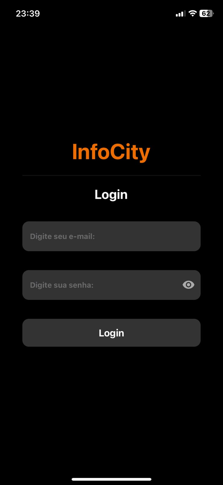
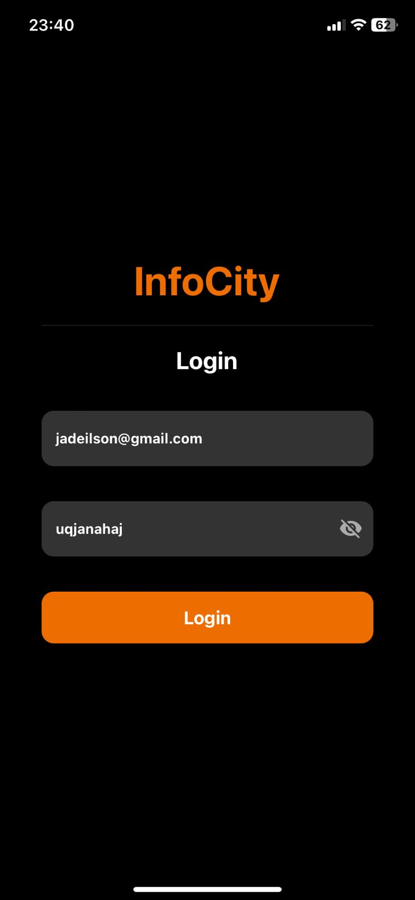
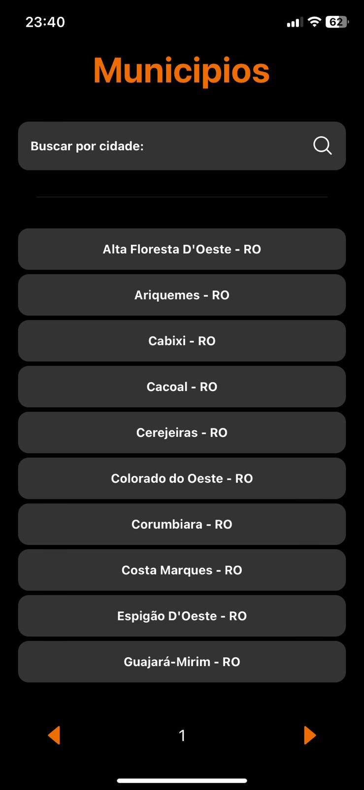
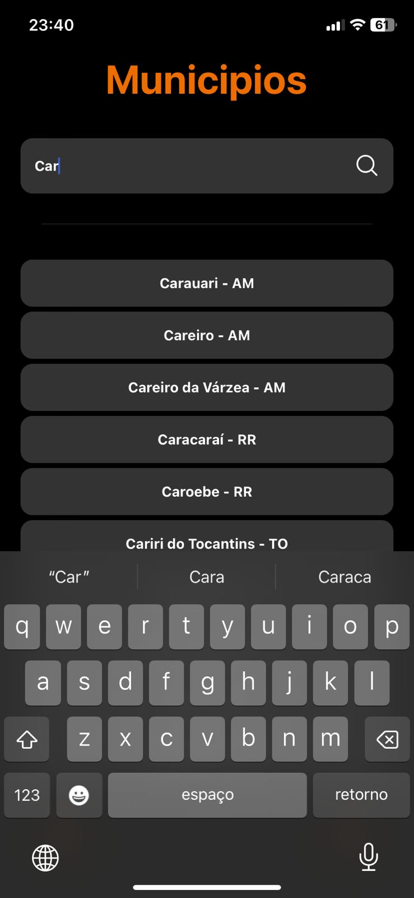
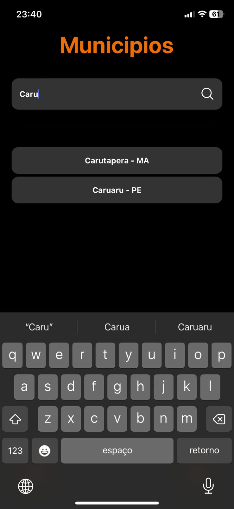

# InfoCity
Aplicação mobile para mostrar informações das cidades brasileira
## 🚀 Começando
Essas instruções permitirão que você obtenha uma cópia do projeto em operação na sua máquina local para fins de desenvolvimento e teste.

* SSH
```
git clone git@github.com:jadeilsonm/InfoCity.git
```
* HTTPS
```
git clone https://github.com/jadeilsonm/InfoCity.git
```
## 📋 Pré-requisitos

- nodejs
- Emulador androi ou IOS instalado e configurado - (opcional)*
- Um dispositivo mobile com EXPO GO instalado

## 🔧 Instalação


Entre no diretorio onde foi clonado o projeto e entre dentro do projeto:
```sh
cd infoCity
```
Instale as dependencias do projetos:
```sh
npm install
```

## ⚡ Executando

Para executar essa aplicação devemos seguir com os seguintes comando.
Depois de ter instalado as dependencias do projeto vamos executar o seguinte comando:
```sh
npm run start
```
Se tudo ocorreu bem ira mostrar um console com algumas intruções e um qrcode do expo.

Se for de sua preferencia podera ler o qrcode e usar por meio do expo go instalado direto de sua loja [APPLE STORE](https://itunes.apple.com/app/apple-store/id982107779) ou [PLAY STORE](https://play.google.com/store/apps/details?id=host.exp.exponent&referrer=www)

Ou se ja tiver tudo configurado podemos executar por meio do emulado android ou IOS, para executar por meio do emulado pressione A no teclado ao iniciar o servidor.

## 🛠️ Construído com:

ferramentas usadas para criar o projeto.

* [NodeJS](https://nodejs.org/en/) - É uma compilação empacotada do mecanismo JavaScript.
* [NPM](https://www.npmjs.com/) - Gerente de Dependência.
* [TypeScript](https://www.typescriptlang.org/) - Usada para tipagem dos paramentros e as variaveis.
* [React Native](https://reactnative.dev/) - Um Framework é um facilitador no desenvolvimento de diversas aplicações e, sem dúvida, sua utilização poupa tempo e custos para quem utiliza, pois de forma mais básica, é um conjunto de bibliotecas utilizadas para criar uma base, onde as aplicações são construídas, um otimizador de recursos.
* [Expo](https://expo.dev/) - O Expo é uma ferramenta utilizada no desenvolvimento mobile com React Native que permite o fácil acesso às API's nativas do dispositivo sem precisar instalar qualquer dependência ou alterar código nativo.

## 📄 Demonstração de usabilidade

### Login

Para fazer login devemos seguir a seguinte regra termos ...(.)...(@)... como por exemplo test@gmail.com e termos uma senha com mais de 5 caracteres






### HOME





### DETALHES


## 📌 Versão

* versão 1.0

* Foi utilizado [github](https://github.com/) para controle de versão e armazenamento de codigo fonte.

## ✒️ Autores

* **desenvolvedor** - *Trabalho Inicial* - [desenvolvedor](https://github.com/jadeilsonm)


## 🎁 Expressões de gratidão

* Conte a outras pessoas sobre este projeto 📢
* Convide alguém da equipe para uma café ☕ 
* Obrigado publicamente 🤓.